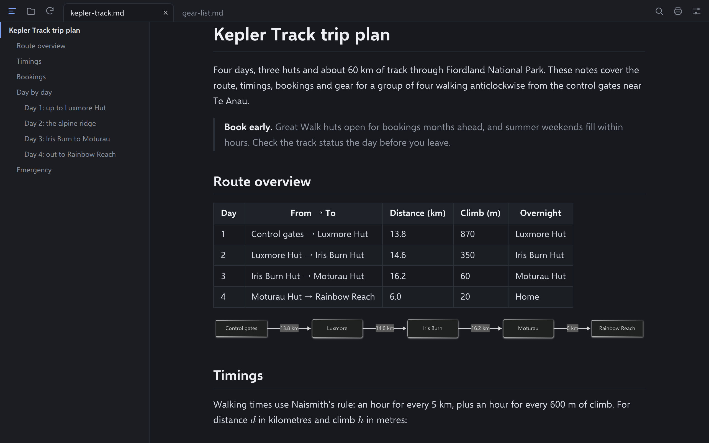
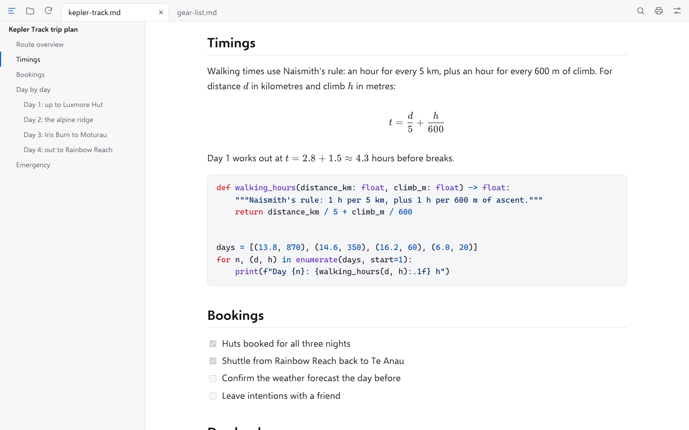
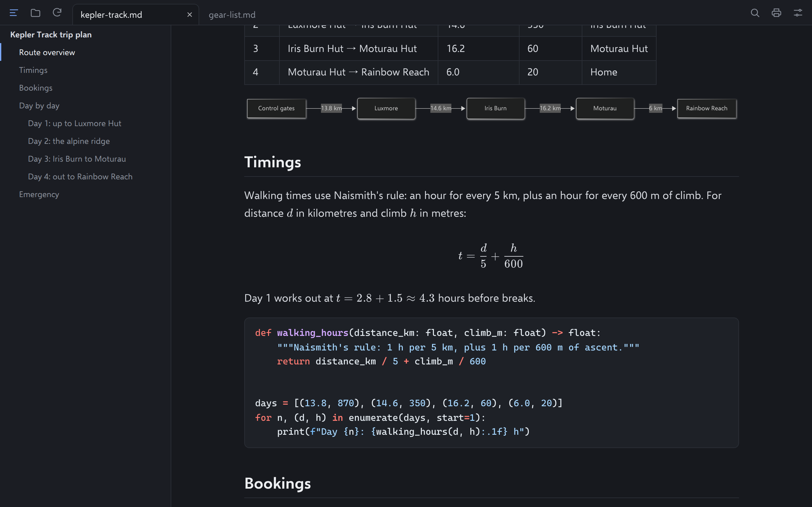
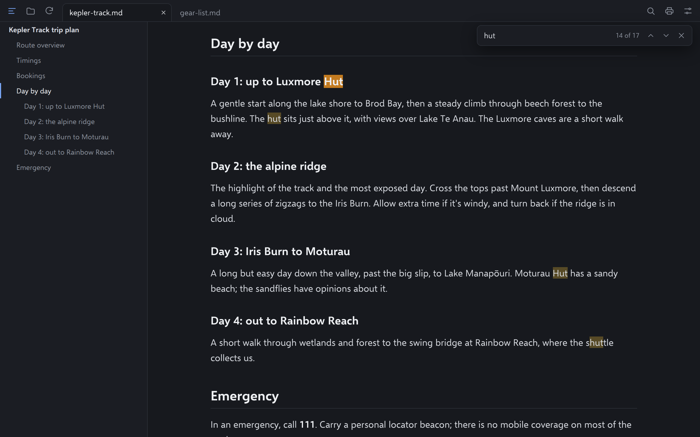
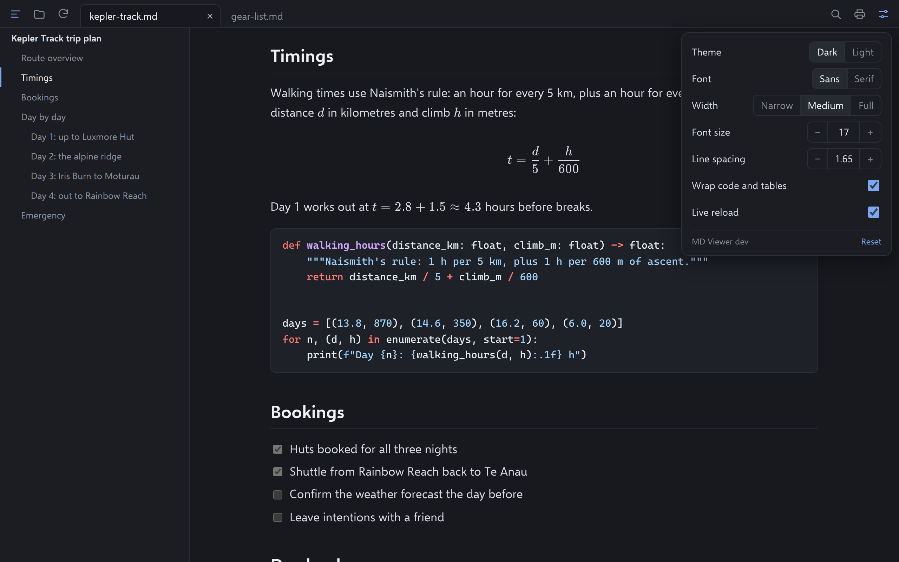

# MD Viewer

A small, fast markdown viewer for Windows, macOS and Linux. It's a single
executable with no installer and no runtime to set up.

<p align="center">
  <a href="docs/screenshots/dark.png"></a>
</p>
<p align="center">
  <a href="docs/screenshots/light.png"></a>
  <a href="docs/screenshots/diagrams.png"></a>
  <a href="docs/screenshots/find.png"></a>
  <a href="docs/screenshots/settings.png"></a>
</p>
<p align="center"><sub>Click a screenshot to see it full size.</sub></p>

- Tabs: open several files at once; opening another file from Explorer or
  Finder adds a tab to the window that's already open
- Dark mode by default, with a light theme
- GitHub-flavoured markdown: tables, task lists, footnotes, strikethrough,
  autolinks, definition lists and raw HTML (sanitised)
- Syntax highlighting for fenced code blocks, with a one-click copy button
- Sortable tables: click a column heading to sort it
- Save as PDF or print, always in light colours
- Mermaid diagrams and KaTeX maths, drawn in the app (no internet needed)
- Table of contents sidebar that follows your place in the document
- Find in document, including parts of large files not yet on screen
- Live reload when the file changes on disk, plus a reload button
- Adjustable font size, line spacing, content width and font
- Word wrap for code blocks and tables, which can be turned off
- Handles large files (tested to 25 MB) by rendering only what's near the
  screen
- Opens local `.md` links in a new tab; web links open in your browser
- Safe with files from anywhere: documents can't run script, and images from
  the web only load if you agree (see [SECURITY.md](SECURITY.md))

## Download

Get the latest build from the [Releases](../../releases) page.

| Platform | File | Notes |
|---|---|---|
| Windows 10/11 | `md-viewer-*-windows-amd64.exe` | Uses Microsoft Edge WebView2, which Windows 10 and 11 already include. |
| macOS 11+ | `md-viewer-*-macos-universal.zip` | Unzip and move `md-viewer.app` to Applications. The app isn't signed, so the first time, right-click it and choose **Open**, or run `xattr -cr /Applications/md-viewer.app`. |
| Linux (x86-64) | `md-viewer-*-linux-amd64.tar.gz` | Needs WebKitGTK 4.1, e.g. `sudo apt install libwebkit2gtk-4.1-0` on Debian or Ubuntu. |

## Usage

Open files with **Open** (Ctrl+O), by dropping them on the window, or from the
command line. Each file gets its own tab:

```
md-viewer notes.md README.md
```

To make it the default app for `.md` files on Windows, right-click a markdown
file, choose **Open with › Choose another app**, browse to `md-viewer.exe` and
tick **Always use this app**.

### Saving as PDF

Click the printer button (Ctrl+P). MD Viewer renders the whole document and
opens the system print dialog. To get a PDF, choose:

- **Save as PDF** as the destination on Windows,
- **PDF › Save as PDF** on macOS,
- **Print to File** on Linux.

The PDF uses light colours whatever theme you're using. Very large files can
take a while to prepare, and you can cancel this.

### Keyboard shortcuts

On macOS, use ⌘ in place of Ctrl (except for Ctrl+Tab, which is the same on
every platform).

| Action | Shortcut |
|---|---|
| Open file (new tab) | Ctrl+O |
| Close tab | Ctrl+W, or middle-click the tab |
| Next / previous tab | Ctrl+Tab / Ctrl+Shift+Tab (or Ctrl+PgDn / Ctrl+PgUp) |
| Go to tab 1–8 / last tab | Ctrl+1 … Ctrl+8 / Ctrl+9 |
| Reload | F5 or Ctrl+R |
| Save as PDF / print | Ctrl+P |
| Table of contents | Ctrl+B |
| Find | Ctrl+F, then Enter / Shift+Enter (or F3 / Shift+F3) |
| Larger / smaller text | Ctrl+= / Ctrl+- or Ctrl+mouse wheel |
| Reset text size | Ctrl+0 |
| Toggle word wrap | Alt+Z |
| Toggle dark / light | Ctrl+Shift+D |

Settings are saved to `md-viewer/settings.json` in your user config folder
(`%AppData%` on Windows, `~/Library/Application Support` on macOS,
`~/.config` on Linux).

## Building from source

You need [Go](https://go.dev/dl/) 1.26.6 or newer and the
[Wails v2](https://wails.io/docs/gettingstarted/installation) CLI:

```
go install github.com/wailsapp/wails/v2/cmd/wails@v2.16.0
```

Then, from the repository root:

```
wails build                                   # for the current platform
wails build -platform windows/amd64           # Windows (can be built from Linux or macOS)
wails build -tags webkit2_41                  # Linux with WebKitGTK 4.1
```

The executable is written to `build/bin/`. Linux builds need
`libgtk-3-dev` and `libwebkit2gtk-4.1-dev`.

Run the tests with `go test ./...`. For quick work on the interface,
`go run ./cmd/devserver file.md` serves the frontend to an ordinary browser at
<http://127.0.0.1:8080>. `scripts/screenshots.mjs` regenerates the screenshots
above (see the comment at the top of the file).

Frontend assets are already bundled; Node.js 22.22.1 and npm are only needed
for vendor maintenance. CI uses that Node.js version for reproducible compression.
Run `bash scripts/update-vendor.sh` to rebuild from `scripts/vendor/package-lock.json`,
or `bash scripts/update-vendor.sh --check` to verify the checked-in assets. To update
dependencies, edit `scripts/vendor/package.json`, regenerate its lock with npm,
audit it with `npm audit --prefix scripts/vendor --audit-level=info`, then rebuild
and update [THIRD-PARTY.md](THIRD-PARTY.md).

### How it works

Markdown is parsed in Go with [goldmark](https://github.com/yuin/goldmark). A
document is split into chunks of about 16 KB, and each chunk's HTML is rendered
only when it scrolls near the view. Chunks far from the view are emptied again.
Files over 1 MB are cut into sections at safe block boundaries and parsed in
parallel, so a 25 MB file opens in well under a second and memory stays close
to the file's size. Mermaid and KaTeX are embedded in the executable,
compressed, and only loaded when a document uses them.

Each chunk's HTML is sanitised before the page sees it, and the page's
Content-Security-Policy keeps out script and anything from outside the app.
[SECURITY.md](SECURITY.md) has the details and how to report a problem.

## Licence

MIT. See [LICENSE](LICENSE). Bundled third-party components are listed in
[THIRD-PARTY.md](THIRD-PARTY.md).
