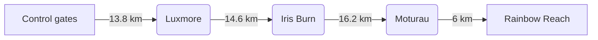

# Kepler Track trip plan

Four days, three huts and about 60 km of track through Fiordland National
Park. These notes cover the route, timings, bookings and gear for a group of
four walking anticlockwise from the control gates near Te Anau.

> **Book early.** Great Walk huts open for bookings months ahead, and summer
> weekends fill within hours. Check the track status the day before you leave.

## Route overview

| Day | From → To                  | Distance (km) | Climb (m) | Overnight      |
|----:|----------------------------|--------------:|----------:|----------------|
|   1 | Control gates → Luxmore Hut |          13.8 |       870 | Luxmore Hut    |
|   2 | Luxmore Hut → Iris Burn Hut |          14.6 |       350 | Iris Burn Hut  |
|   3 | Iris Burn Hut → Moturau Hut |          16.2 |        60 | Moturau Hut    |
|   4 | Moturau Hut → Rainbow Reach |           6.0 |        20 | Home           |



## Timings

Walking times use Naismith's rule: an hour for every 5 km, plus an hour for
every 600 m of climb. For distance $d$ in kilometres and climb $h$ in metres:

$$
t = \frac{d}{5} + \frac{h}{600}
$$

Day 1 works out at $t = 2.8 + 1.5 \approx 4.3$ hours before breaks.

```python
def walking_hours(distance_km: float, climb_m: float) -> float:
    """Naismith's rule: 1 h per 5 km, plus 1 h per 600 m of ascent."""
    return distance_km / 5 + climb_m / 600


days = [(13.8, 870), (14.6, 350), (16.2, 60), (6.0, 20)]
for n, (d, h) in enumerate(days, start=1):
    print(f"Day {n}: {walking_hours(d, h):.1f} h")
```

## Bookings

- [x] Huts booked for all three nights
- [x] Shuttle from Rainbow Reach back to Te Anau
- [ ] Confirm the weather forecast the day before
- [ ] Leave intentions with a friend

## Day by day

### Day 1: up to Luxmore Hut

A gentle start along the lake shore to Brod Bay, then a steady climb through
beech forest to the bushline. The hut sits just above it, with views over
Lake Te Anau. The Luxmore caves are a short walk away.

### Day 2: the alpine ridge

The highlight of the track and the most exposed day. Cross the tops past
Mount Luxmore, then descend a long series of zigzags to the Iris Burn. Allow
extra time if it's windy, and turn back if the ridge is in cloud.

### Day 3: Iris Burn to Moturau

A long but easy day down the valley, past the big slip, to Lake Manapōuri.
Moturau Hut has a sandy beach; the sandflies have opinions about it.

### Day 4: out to Rainbow Reach

A short walk through wetlands and forest to the swing bridge at Rainbow
Reach, where the shuttle collects us.

## Emergency

In an emergency, call **111**. Carry a personal locator beacon; there is no
mobile coverage on most of the track.
