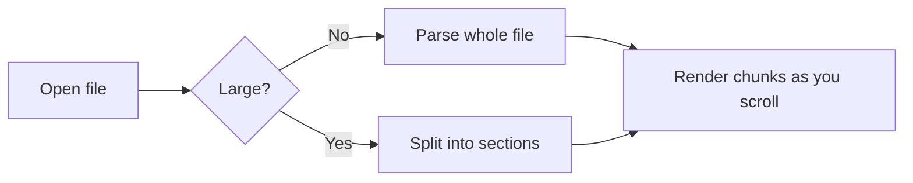
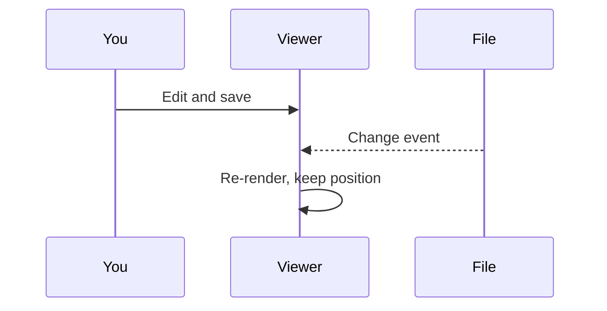

# MD Viewer sample

This file shows the formatting MD Viewer supports. Open it with the viewer and
try the table of contents, find (Ctrl+F), and the settings menu.

## Text

Plain paragraphs wrap to the window. You can use **bold**, *italic*,
***both***, ~~strikethrough~~, `inline code`, <kbd>Ctrl</kbd>+<kbd>F</kbd>,
H<sub>2</sub>O, x<sup>2</sup> and <mark>highlighted text</mark>.

Autolinks such as https://example.com work, as do [named links](https://example.com),
[links to headings](#tables) and [links to other files](other.md#second-section).

> Block quotes are shown with a rule on the left.
>
> > They can be nested, too.

---

## Lists

- Colour and behaviour are spelt the New Zealand way
- Nested lists
  - second level
    - third level
- Back to the top

1. First
2. Second
   1. Sub-item
3. Third

### Task list

- [x] Dark mode by default
- [x] Word wrap on by default
- [ ] Something still to do

### Definition list

Term
: The definition of the term.

## Tables

| Feature        | Shortcut           | Notes                                  |
|:---------------|:------------------:|---------------------------------------:|
| Open           | Ctrl+O             | Or drop a file on the window           |
| Reload         | F5                 | Live reload is on by default           |
| Contents       | Ctrl+B             | Shows the table of contents            |
| Find           | Ctrl+F             | Enter for next, Shift+Enter for previous |
| Font size      | Ctrl+= / Ctrl+-    | Ctrl+0 resets                          |
| Word wrap      | Alt+Z              | Applies to code blocks and tables      |
| Theme          | Ctrl+Shift+D       | Dark or light                          |

A wide table, to try word wrap:

| Column one | Column two | Column three | Column four | Column five | Column six | Column seven |
|---|---|---|---|---|---|---|
| a fairly long cell of text that goes on | another long cell of text for testing | more text here to make it wide | and some more | and more again | nearly there | the end of a very wide row |

## Code

```go
// Package main says hello.
package main

import "fmt"

func main() {
	colours := []string{"red", "green", "blue"}
	for i, c := range colours {
		fmt.Printf("%d: %s\n", i, c)
	}
}
```

```js
const greet = (name) => `Kia ora, ${name}!`;
console.log(greet('world')); // a long comment that runs past the edge of the window, to show what word wrap does to code blocks
```

```python
def fib(n: int) -> int:
    """Return the nth Fibonacci number."""
    a, b = 0, 1
    for _ in range(n):
        a, b = b, a + b
    return a
```

```
A plain code block with no language.
```

## Diagrams





## Maths

Inline maths like $e^{i\pi} + 1 = 0$ sits within a sentence, while prices such as
$5 and $10 are left alone.

$$
\int_0^1 x^2 \, dx = \frac{1}{3}
$$

$$
\begin{aligned}
(a+b)^2 &= a^2 + 2ab + b^2 \\
(a-b)^2 &= a^2 - 2ab + b^2
\end{aligned}
$$

## Images

A local image, sized with HTML:


And the same image in markdown syntax:


## Footnotes

Here is a statement with a footnote.[^note] And another one.[^2]

[^note]: Footnotes are collected at the end of the document.
[^2]: Click the arrow to jump back.

## HTML

<details>
<summary>Click to expand</summary>

Hidden content with **markdown** inside.

</details>

<p align="center">Centred with raw HTML.</p>

<script>alert('scripts are removed')</script>

## Duplicate heading

## Duplicate heading

The two headings above get distinct anchors (`#duplicate-heading` and
`#duplicate-heading-1`).
